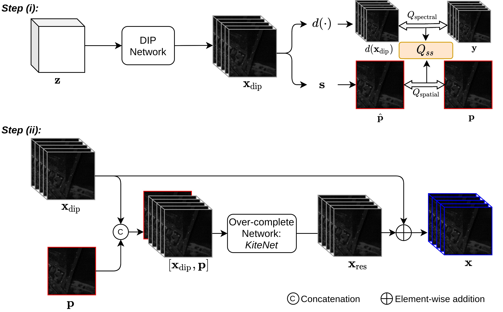
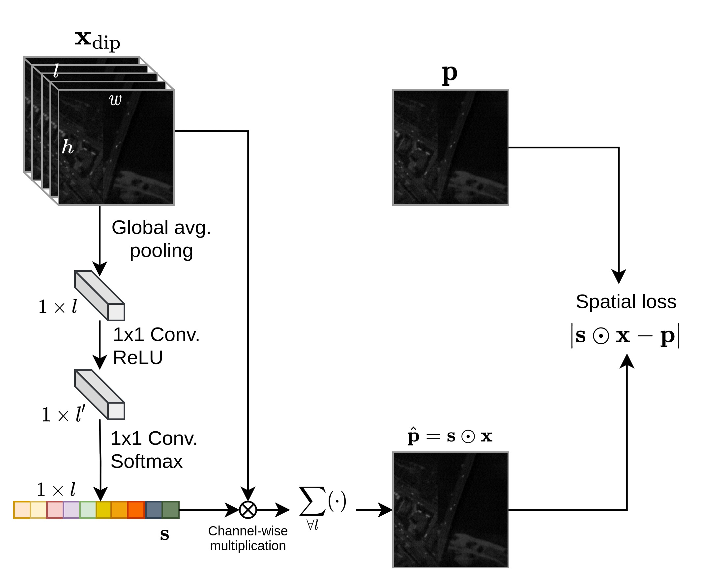
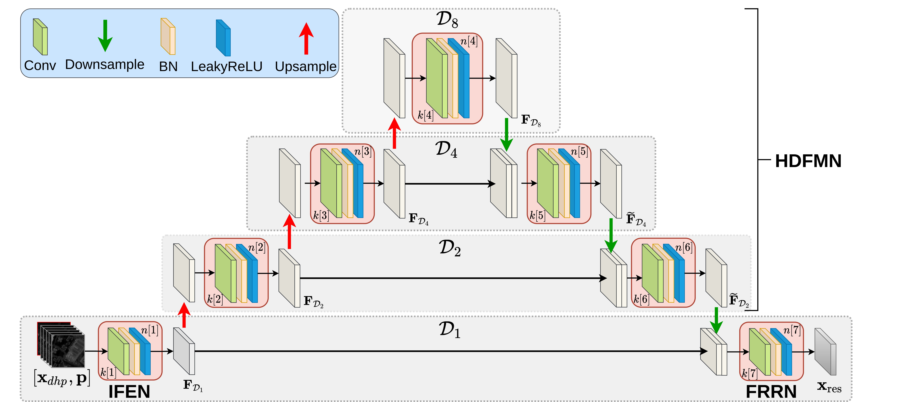
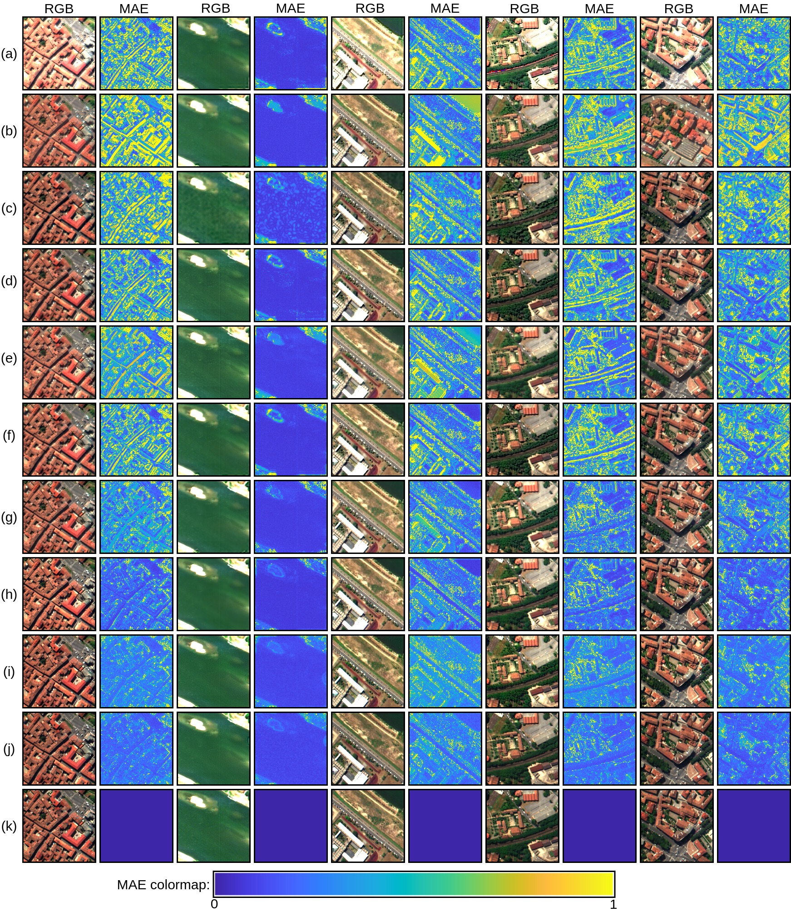
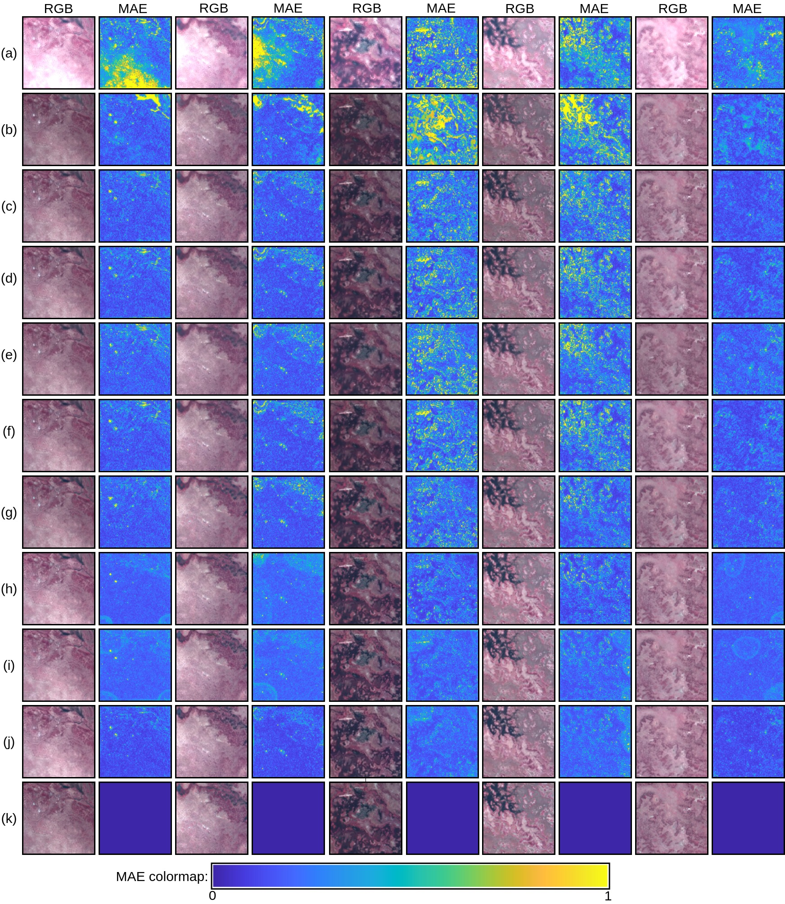
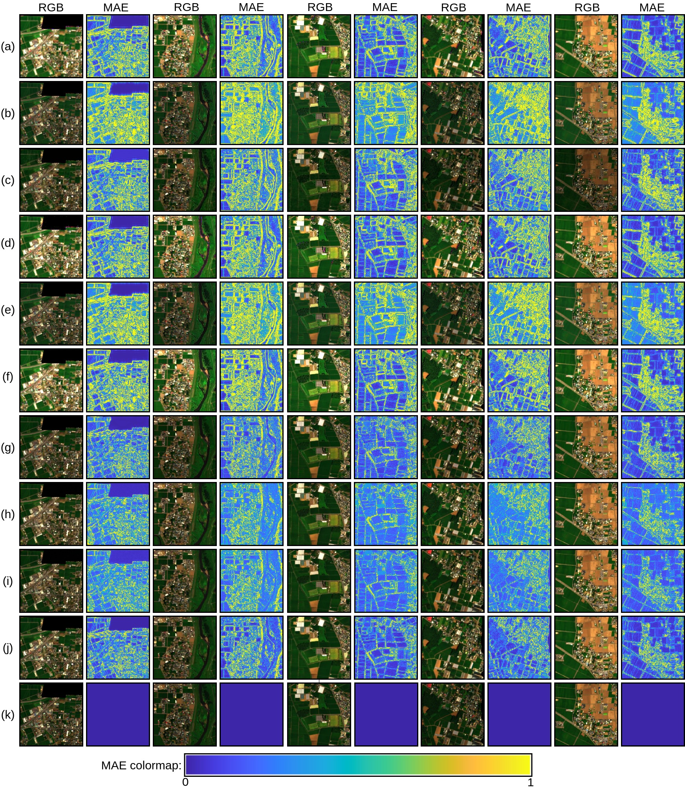

# DIP-HyperKite: Hyperspectral Pansharpening Based on Improved Deep Image Prior and  Residual Reconstruction
[Wele Gedara Chaminda Bandara](https://www.researchgate.net/profile/Chaminda-Bandara-4), [Jeya Maria Jose Valanarasu](https://jeya-maria-jose.github.io/research/), [Vishal M. Patel](https://engineering.jhu.edu/vpatel36/sciencex_teams/vishalpatel/)

[[Paper Link](https://arxiv.org/abs/2107.02630)] (Preprint submitted to IEEE Transactions on Geoscience and Remote Sensing)

## Abstract
Hyperspectral pansharpening aims to synthesize a low-resolution hyperspectral image (LR-HSI) with a registered panchromatic image (PAN) to generate an enhanced HSI with high spectral and spatial resolution.  Recently proposed HS pansharpening methods have obtained remarkable results using deep convolutional networks (ConvNets), which typically consist of three steps: (1) up-sampling the LR-HSI, (2) predicting the residual image via a ConvNet, and (3) obtaining the final fused HSI by adding the outputs from first and second steps.  Recent methods have leveraged Deep Image Prior (DIP) to up-sample the LR-HSI due to its excellent ability to preserve both spatial and spectral information, without learning from  large data sets. However, we observed that the quality of up-sampled HSIs can be further improved by introducing an additional spatial-domain constraint to the conventional spectral-domain energy function. We define our spatial-domain constraint as the $L_1$ distance between the predicted PAN image and the actual PAN image. To estimate the PAN image of the up-sampled HSI, we also propose a learnable spectral response function (SRF). Moreover, we noticed that the residual image between the up-sampled HSI and the reference HSI mainly consists of edge information and very fine structures. In order to accurately estimate fine information, we propose a novel over-complete network, called HyperKite, which focuses on learning high-level features by constraining the receptive from increasing in the deep layers.

## Citation
    @inproceedings{bandara2021hyperspectral,
    title={Hyperspectral Pansharpening Based on Improved Deep Image Prior and Residual Reconstruction},
    author={Bandara, Wele Gedara Chaminda and Valanarasu, Jeya Maria Jose and Patel, Vishal M},
    journal={arXiv preprint arXiv:2107.02630},
    year={2021}
    } 

## DIP-HyperKite Network

## Proposed Spatial Loss Function for DIP Process

## Proposed HyperKite Network for Residual Prediction

## Downloading Datasets
In this paper, we used three publically available datasets and the link to each dataset is given below:
1. Pavia Center Dataset: [Click Here](http://www.ehu.eus/ccwintco/index.php/Hyperspectral_Remote_Sensing_Scenes)
2. Botswana Dataset: [Click Here](http://www.ehu.eus/ccwintco/index.php/Hyperspectral_Remote_Sensing_Scenes)
3. Chikusei Dataset: [Click Here](https://naotoyokoya.com/Download.html)
Once you downloaded the dataset in .mat format save them in respective folders.
 
## Qaulitative Results on [Pavia Center Dataset](http://www.ehu.eus/ccwintco/index.php/Hyperspectral_Remote_Sensing_Scenes)

## Qaulitative Results on [Botswana Dataset](http://www.ehu.eus/ccwintco/index.php/Hyperspectral_Remote_Sensing_Scenes)

## Qaulitative Results on [Chikusei Dataset](https://naotoyokoya.com/Download.html)

